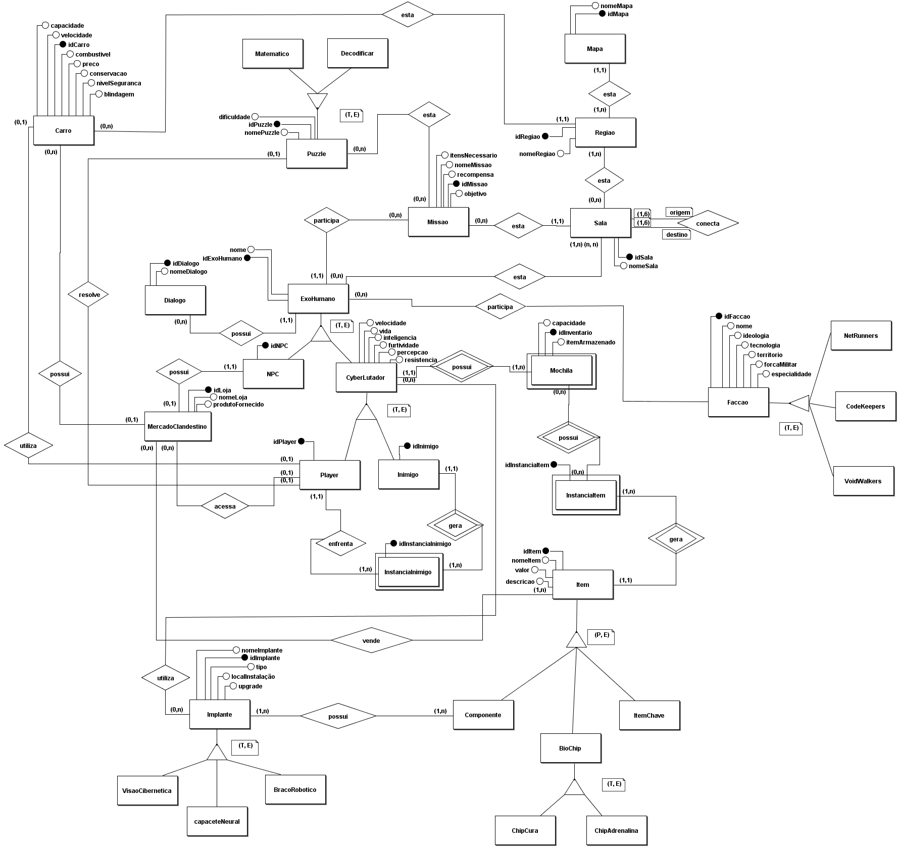

# Introdução

O Diagrama Entidade-Relacionamento (DER) é uma ferramenta visual usada para modelar bancos de dados, representando as entidades do sistema e seus relacionamentos. Ele ajuda a organizar e estruturar os dados antes da implementação, facilitando a compreensão das interações entre as entidades, como clientes e produtos.

# Diagrama Entidade-Relacionamento

O DER apresentado na figura 1, foi desenvolvido pelo grupo como parte do projeto do jogo ambientado no universo cyberpunk. O processo de criação foi colaborativo, envolvendo reuniões frequentes para alinhamento de ideias e integração de contribuições de todos os membros. Durante essas sessões, discutimos e refinamos os conceitos, sempre mantendo o foco em representar de forma clara as entidades e os relacionamentos que compõem a lógica do jogo.  

Para garantir a qualidade e a aderência às melhores práticas, dúvidas surgidas durante o desenvolvimento foram esclarecidas junto ao professor responsável pela disciplina, que forneceu orientações valiosas sobre os ajustes necessários.

<h6 align="center">Figura 1 - Diagrama de Entidade de Relacionamento do projeto Cyberpunk</h6>

<h6 align="center">Fonte: <a href="https://github.com/charles-serafim">Charles Serafim</a> ,<a href="https://github.com/GabriellyAssuncao">Gabrielly Assunção</a>, <a href="https://github.com/Jauzimm">João Vitor Santos</a>,<a href="https://github.com/Katuner">Lucas Meireles</a>, <a href="https://github.com/EduardaSMarques">Maria Eduarda Marques</a>.2024.</h6>

## Histórico de versões

| Versão |  Data  | Descrição | Autor | 
|:------:|:------:|:---------:|------:|
| 1.0 | 21/11/2024 | Padronização e adição do DER | [João Vitor Santos](https://github.com/Jauzimm) |
| 1.1 | 24/11/2024 | Correção do DER| [Maria Eduarda Marques](https://github.com/EduardaSMarques) |
| 1.2 | 25/11/2024 | Colocando descriçãoo de como foi feito e fonte| [Maria Eduarda Marques](https://github.com/EduardaSMarques) |