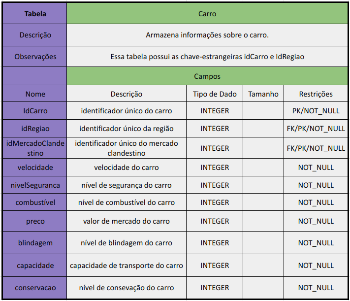
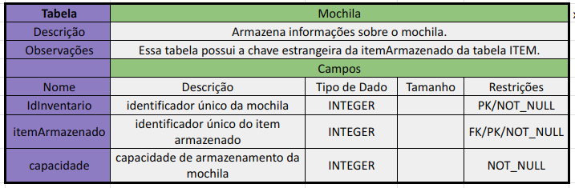
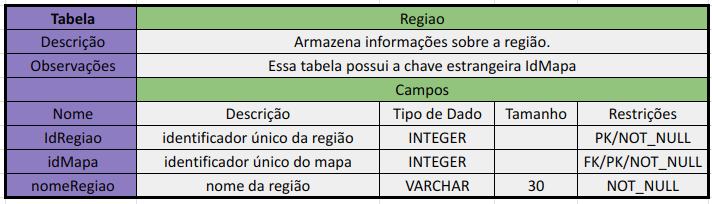

# Introdução

O dicionário de dados é uma documentação estruturada que descreve, de forma detalhada, os elementos de dados utilizados em um sistema. Ele inclui informações como nomes, tipos, tamanhos, restrições e descrições de cada atributo, servindo como uma referência essencial para o entendimento e implementação do banco de dados.  

# Dicionário de Dados

Neste projeto, na o dicionário de dados foi desenvolvido com base no modelo relacional elaborado pelo grupo. Utilizamos o modelo como base para definir as tabelas, colunas e relacionamentos do sistema. O trabalho coletivo, aliado a revisões cuidadosas, assegurou que todas as informações relevantes fossem registradas, refletindo a complexidade e as necessidades do jogo ambientado no universo cyberpunk.

<h6 align="center">Figura 1 - Carro</h6>

<h6 align="center">Fonte: <a href="https://github.com/GabriellyAssuncao">Gabrielly Assunção</a>.2024.</h6>

<h6 align="center">Figura 2 - Mapa</h6>

<h6 align="center">Fonte: <a href="https://github.com/GabriellyAssuncao">Gabrielly Assunção</a>.2024.</h6>

<h6 align="center">Figura 3 - Mercado Clandestino</h6>

<h6 align="center">Fonte: <a href="https://github.com/GabriellyAssuncao">Gabrielly Assunção</a>.2024.</h6>

<h6 align="center">Figura 4 - Mochila</h6>

<h6 align="center">Fonte: <a href="https://github.com/GabriellyAssuncao">Gabrielly Assunção</a>.2024.</h6>

<h6 align="center">Figura 5 - Região</h6>

<h6 align="center">Fonte: <a href="https://github.com/GabriellyAssuncao">Gabrielly Assunção</a>.2024.</h6>

<h6 align="center">Figura 6 - Sala</h6>

<h6 align="center">Fonte: <a href="https://github.com/GabriellyAssuncao">Gabrielly Assunção</a>.2024.</h6>

<h6 align="center">Figura 7 - Facção</h6>

<h6 align="center">Fonte: <a href="https://github.com/GabriellyAssuncao">Gabrielly Assunção</a>.2024.</h6>

<h6 align="center">Figura 8 - NetRunners</h6>

<h6 align="center">Fonte: <a href="https://github.com/GabriellyAssuncao">Gabrielly Assunção</a>.2024.</h6>

<h6 align="center">Figura 9 - VoidWalkers</h6>

<h6 align="center">Fonte: <a href="https://github.com/GabriellyAssuncao">Gabrielly Assunção</a>.2024.</h6>

<h6 align="center">Figura 10 - CodeKeepers</h6>

<h6 align="center">Fonte: <a href="https://github.com/GabriellyAssuncao">Gabrielly Assunção</a>.2024.</h6>

<h6 align="center">Figura 11 - ExoHumano</h6>

<h6 align="center">Fonte: <a href="https://github.com/GabriellyAssuncao">Gabrielly Assunção</a>.2024.</h6>

<h6 align="center">Figura 12 - NPC</h6>

<h6 align="center">Fonte: <a href="https://github.com/GabriellyAssuncao">Gabrielly Assunção</a>.2024.</h6>

<h6 align="center">Figura 13 - Player</h6>

<h6 align="center">Fonte: <a href="https://github.com/GabriellyAssuncao">Gabrielly Assunção</a>.2024.</h6>

<h6 align="center">Figura 14 - Diálogo</h6>

<h6 align="center">Fonte: <a href="https://github.com/GabriellyAssuncao">Gabrielly Assunção</a>.2024.</h6>

<h6 align="center">Figura 15 - CyberLutador</h6>

<h6 align="center">Fonte: <a href="https://github.com/GabriellyAssuncao">Gabrielly Assunção</a>.2024.</h6>

<h6 align="center">Figura 16 - Inimigo</h6>

<h6 align="center">Fonte: <a href="https://github.com/GabriellyAssuncao">Gabrielly Assunção</a>.2024.</h6>

<h6 align="center">Figura 17 - Instância de Inimigo</h6>

<h6 align="center">Fonte: <a href="https://github.com/GabriellyAssuncao">Gabrielly Assunção</a>.2024.</h6>

<h6 align="center">Figura 18 - Implante</h6>

<h6 align="center">Fonte: <a href="https://github.com/GabriellyAssuncao">Gabrielly Assunção</a>.2024.</h6>

<h6 align="center">Figura 19 - Capacete Neural</h6>

<h6 align="center">Fonte: <a href="https://github.com/GabriellyAssuncao">Gabrielly Assunção</a>.2024.</h6>

<h6 align="center">Figura 20 - Visão Cibernética</h6>

<h6 align="center">Fonte: <a href="https://github.com/GabriellyAssuncao">Gabrielly Assunção</a>.2024.</h6>

<h6 align="center">Figura 21 - Braço Robótico</h6>

<h6 align="center">Fonte: <a href="https://github.com/GabriellyAssuncao">Gabrielly Assunção</a>.2024.</h6>

<h6 align="center">Figura 22 - Puzzle</h6>

<h6 align="center">Fonte: <a href="https://github.com/EduardaSMarques">Maria Eduarda Marques</a>.2024.</h6>

<h6 align="center">Figura 23 - Matematico</h6>

<h6 align="center">Fonte: <a href="https://github.com/EduardaSMarques">Maria Eduarda Marques</a>.2024.</h6>

<h6 align="center">Figura 24 - Decodificar</h6>

<h6 align="center">Fonte: <a href="https://github.com/EduardaSMarques">Maria Eduarda Marques</a>.2024.</h6>

<h6 align="center">Figura 25 - Missão</h6>

<h6 align="center">Fonte: <a href="https://github.com/EduardaSMarques">Maria Eduarda Marques</a>.2024.</h6>

<h6 align="center">Figura 26 - Item</h6>

<h6 align="center">Fonte: <a href="https://github.com/EduardaSMarques">Maria Eduarda Marques</a>.2024.</h6>

# Histórico de Versões
| Data       | Versão | Descrição   | Autor     |
| ---------- | ------ | ----------- | --------- |
| 23/11/2024 | 1.0   | Criacao do Documento e Adição das primeiras tabelas. | [@GabriellyAssuncao](https://github.com/GabriellyAssuncao) |
| 24/11/2024 | 1.1   | Adição de outras tabelas | [@GabriellyAssuncao](https://github.com/GabriellyAssuncao) |
| 24/11/2024 | 1.2   | Mais algumas tabelas | [@GabriellyAssuncao](https://github.com/GabriellyAssuncao) |
| 25/11/2024 | 1.3   | Adicionando introdução, figuras 22 a 26 e corrigindo padronização | [Maria Eduarda Marques](https://github.com/EduardaSMarques) |
